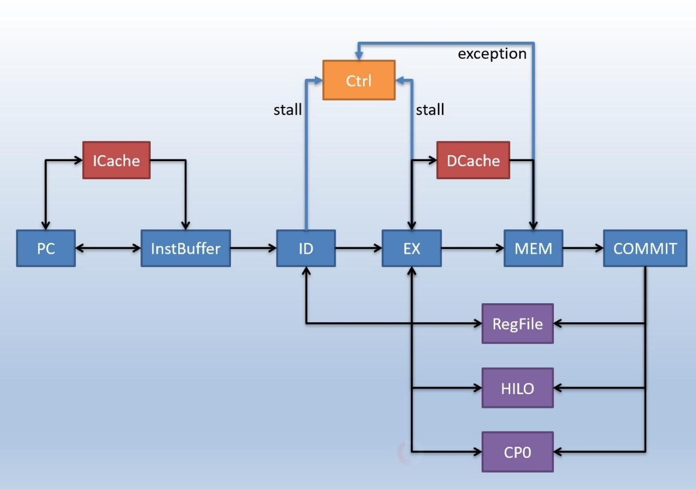
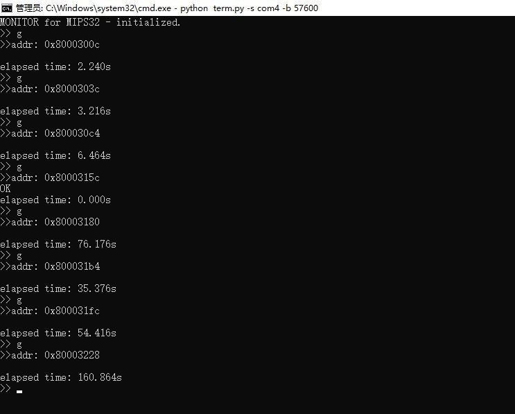
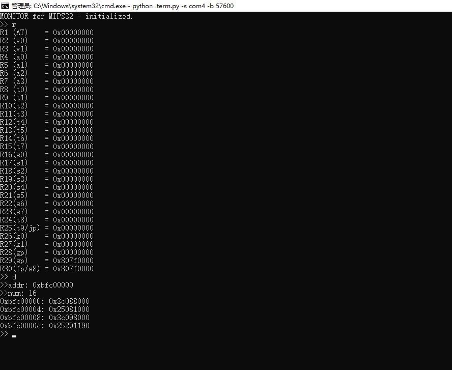

# 2022_NSCSCC_MoYuSpecialists

FPGA上六级流水线MIPS微系统的设计与实现

2022年第六届“龙芯杯”全国大学生计算机系统能力培养大赛参赛作品（MIPS团体赛赛道）

哈尔滨工业大学（深圳）3队，摸鱼专业户队

## 项目简介

本项目使用Verilog语言实现了一个**单发射六级流水处理器**，具有以下主要特点：

- 将经典五级流水线的取指级拆分为**取指请求、取指缓存**两级，使取指与执行解耦合，充分预取指令以提升性能；
- 实现了**自陷、特权指令**以及**CP0寄存器**，并支持中断、地址错、系统调用、保留指令、整型溢出等常见**中断例外**；
- Cache采用**二路组相联**设计，并使用**伪LRU替换策略**以及**VIPT**；
- 测试集性能分为龙芯gs132处理器的**5.32倍**，IPC为其**3.368倍**，能正确运行**记忆游戏、清华大学监控程序**。

相关文档如下：

- [设计文档](./documents/design.pdf)

- [决赛答辩展示](./documents/presentation.pdf)

该作品最终获得**全国总决赛三等奖**，其工程环境构建可参考比赛发布包。

## 根目录下主要文件说明

- documents
  - design.pdf：设计文档
  - presentation.pdf：决赛答辩ppt转换而来的pdf

- final_test：存放决赛指令集答题所修改的代码
- ip：存放需要使用到的IP核
- src：存放参赛作品源代码
- .gitattributes：git配置文件
- LICENSE：MIT开源许可证
- README.md：本文档

## 效果展示

